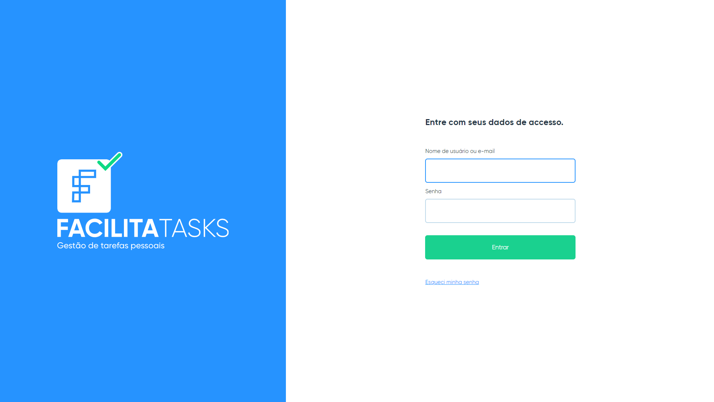
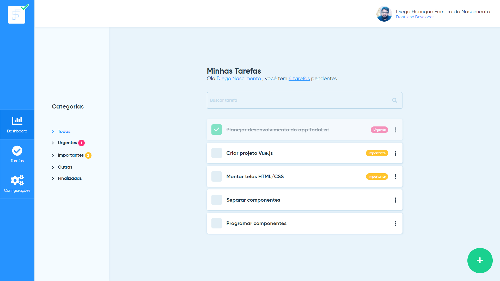
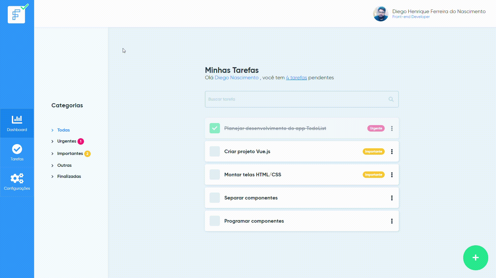

<h1 align="center">
    
</h1>

## Descrição do Projeto

Projeto de front-end para seleção técnica da empresa App Facilita. O projeto consiste em implementar uma Todo List segundo o desafio elaborado pela empresa, seguindo o layout fornecido no [repositório](https://bitbucket.org/mundoon-dev/teste-front-end/src/master/) do desafio.

## Status

#### 🚧  Em construção...  🚧

 - [x] Level 1
 - [x] Level 2

## Desafio

### Level 1

- [x] Utilizar Vue.js versão 2+ (Não utilizar a versão 3)
- [x] Montar as telas do app seguindo fielmente o design
- [x] Não utilizar nenhum framework CSS
- [x] Utilizar Stylus como pré-processador CSS
- [x] Componentizar os elementos das telas o máximo possível.

#### Extras

 - [x] Responsividade das telas
 - [x] Comente o código criando uma mini documentação
 - [x] Hospede o projeto em um servidor e nos mande a URL para visualização.

### Level 2

- [x] Programar a aplicação TodoList
- [x] Utilizar localstorage para persistir os dados
- [x] Utilizar ECMAScript 6+
- [x] Colocar projeto no Github

#### Extras

 - [x] Crie o recurso de edição da tarefa
 - [x] Implemente uma busca que utiliza os campos título e descrição juntos.
 - [x] Ao listar todas as tarefas, ordene a lista de acordo com a prioridade:  - Urgentes, Importantes, Outras
 - [ ] Utilize o Vuex

## Demonstração da aplicação

O deploy da aplicação pode ser encontrada [AQUI](https://facilita-tasks.vercel.app/login), e a seguir prints das telas implementadas:

Tela de Login:

<h3 align="center">
    
</h3>

Tela principal:

<h3 align="center">
    
</h3>

Demostração de interações:

<h3 align="center">
    
</h3>

## Pré-requisitos e como rodar a aplicação
### Pré-requisitos

Antes de começar, você vai precisar ter instalado em sua máquina as seguintes ferramentas:
[Git](https://git-scm.com), [Node.js](https://nodejs.org/en/). 
Além disto é bom ter um editor para trabalhar com o código como [VSCode](https://code.visualstudio.com/)

### 🎲 Rodando a aplicação (Localmente) 

```bash
# Clone este repositório
$ git clone https://github.com/diegondev/facilita-tasks.git

# Acesse a pasta do projeto no terminal/cmd
$ cd facilita-tasks

# Instale as dependências
$ npm install

# Execute a aplicação em modo de desenvolvimento
$ npm run serve

# O servidor inciará na porta:8080 - acesse <http://localhost:8080>
```

## Autor
<div style="display:flex;flex-direction:column;align-items: center">
    <a href="#">
 
 <br />
 <sub><b>Diego Nascimento</b></sub>
 </a>

 Feito com ❤️ por Diego Nascimento 👋🏽 Entre em contato!

 [](https://twitter.com/diegohfn) 
 [](https://www.linkedin.com/in/diego-nascimento-a51b6898/) 
[](mailto:diegohfn@gmail.com)
</div>